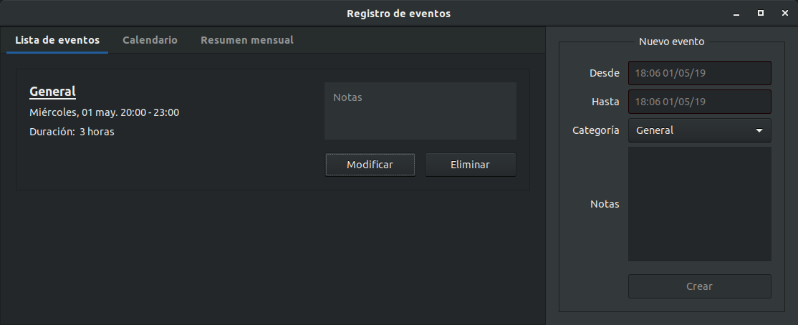
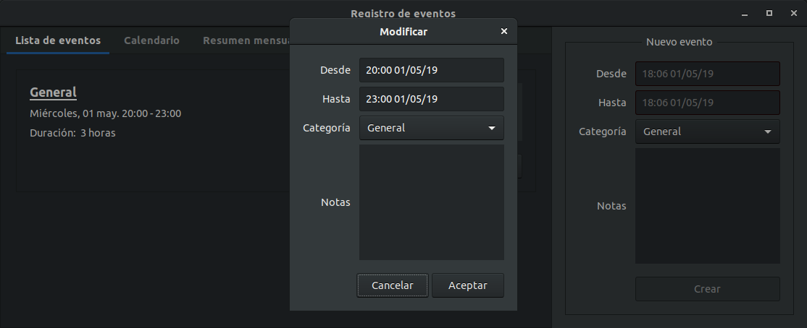
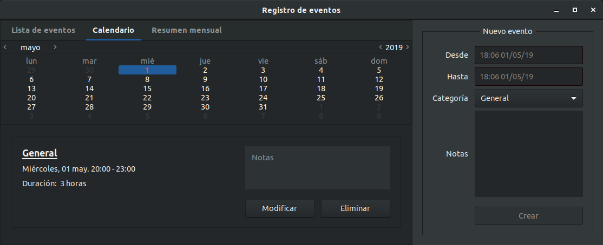
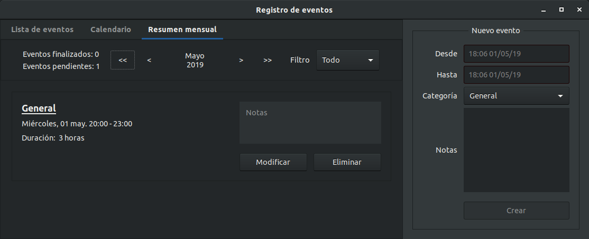

<h1 align="center">Gestor de tareas</h1>

## Introducción
En este proyecto se ha desarrollado una aplicación para ayudar a gestionar un conjunto de tareas repetitivas, donde por cada período de actividad tendremos un registro con varias tareas. Cada tarea viene dada por los siguientes atributos:

- Fecha y hora de comienzo de la tarea.

- Fecha y hora de fin de la tarea.

- Categoría de la tarea.

- Descripción de la tarea.

Los casos de uso soportados por la aplicación son los siguientes:

- Añadir una tarea.

- Eliminar una tarea.

- Modificar los datos de una tarea.

- Ver todas las tareas de un día.

- Ver todos los días para los que hay tareas.

- Ver un resumen mensual.

## Implementación
Este proyecto es una aplicación cliente/servidor convencional, pero únicamente está desarrollada la parte cliente. La parte servidor con la que interactúa se puede encontrar en el siguiente repositorio: https://github.com/nbarreira/simpletracker

La lista de categorías seleccionable para una tarea no es configurable, en su lugar se ha optado por una lista fija *hardcoded* en el propio código de la aplicación, por sensillez en su implementación.

En la carpeta docs se pueden encontrar las priority guides y wireframes realizados, donde se planteo previamente la estructura visual que tendría la aplicación, así como los diagramas de clases de cada módulo y un diagrama de secuencia para el caso de uso "añadir una tarea".

## Aplicación
En las imágenes inferiores se muestra el resultado final de la aplicación.

<div align="center">
  
  
  
  
</div>

## Ejecución
Para que la aplicación funcione correctamente es necesario que la parte servidor esté previamente en funcionamiento. Esta se puede encontrar en el siguiente repositorio: https://github.com/nbarreira/simpletracker

```
./view.py
```
